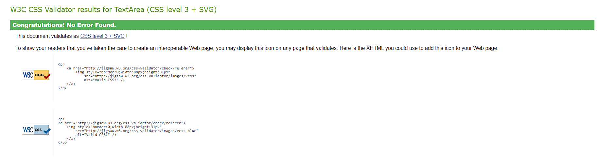

# Niccolò Machiavelli Website

### Project Description

The Niccolò Machiavelli website is a comprehensive platform dedicated to the works, philosophy, and legacy of the renowned Italian Renaissance political philosopher, historian, and writer, Niccolò Machiavelli. The website serves as a valuable resource for researchers, students, and enthusiasts, providing insights into Machiavelli's literary contributions, biographical details, and opportunities to engage with the Machiavellian community

## Project Goals

The primary goal of the Niccolò Machiavelli website is to create a one-stop destination for individuals interested in exploring Machiavelli's works and philosophy. The website aims to:

- Educate users about Niccolò Machiavelli's life, writings, and political theories.
- Provide access to Machiavelli's literary works, including books, essays, and letters.
- Promote the Machiavellian summit, an annual event gathering scholars and fans.
- Facilitate community interaction and discussion on Machiavellian topics.
- Ensure a responsive and user-friendly experience across all devices and platforms.

### Responsiveness

The Niccolò Machiavelli website is designed to be fully responsive across various devices and screen sizes. The screenshot below showcases how the website adapts to different displays.

 _Responsive Screenshot of the Website_

## Table of Contents

1. [Project Description](#project-description)
2. [User Experience (UX) Development](#user-experience-ux-development)
3. [Design Choices](#design-choices)
4. [Wireframes](#wireframes)
5. [Features](#features)
6. [Technologies Used](#technologies-used)
7. [Testing](#testing)
8. [Accessibility](#accessibility)
9. [Deployment](#deployment)
10. [Development Process](#development-process)
11. [Challenges and Solutions](#challenges-and-solutions)
12. [Performance Optimization](#performance-optimization)
13. [License Information](#license-information)
14. [Future Plans and Roadmap](#future-plans-and-roadmap)
15. [Glossary](#glossary)
16. [Credits](#credits)

## Niccolò Machiavelli

### Target Audience

The website caters to researchers, students, scholars, historians, and anyone interested in political philosophy and Renaissance literature. Whether you are a new explorer or a returning admirer of Machiavelli's works, the platform provides valuable content for all:

- **Researchers**: Comprehensive resources for in-depth exploration.
- **Students**: Accessible information for academic pursuits.
- **Machiavelli Enthusiasts**: Engaging content for literary exploration.

### Live Website Link

[Visit the Niccolò Machiavelli website](#https://makiaveli1.github.io/Machiavelli/)
### Content

The Niccolò Machiavelli website is divided into key sections, each serving a specific purpose:

- **Home Page**: Introduction to Machiavelli's life and works.

- **Biography Page**: In-depth exploration of Machiavelli's life, achievements, and timeline.

- **Signup Page**: Registration for upcoming machiavellian summit.

The content is curated to engage users in an immersive experience, enabling them to explore, learn, and connect with the world of Machiavelli.

## User Experience (UX) Development

### User Personas and Goals

The Niccolò Machiavelli website caters to different user personas, each with specific goals:

- **Researchers**: Access comprehensive resources and analyses of Machiavelli's works.
- **Students**: Explore Machiavelli's life and writings for academic pursuits.
- **Machiavellian Enthusiasts**: Engage in literary exploration and community participation.

The website offers a structured and intuitive user journey, enabling both new and returning users to navigate seamlessly and find the desired content.

### User Stories

- **As a new user**: I want to learn about Machiavelli's life and writings.
- **As a returning user**: I want to register for the Machiavellian Summit and engage with the community.
- **As an academic**: I want to access resources and analyses for my research.

## Design Choices

### Typography

The website uses the font family "IM Fell Great Primer SC," giving a classic and scholarly appearance.

### Color Scheme

The color scheme includes:
#5a5a5a, #ff0000, #ffffff, and #8a8a8a.

These colors create a harmonious and engaging visual experience, resonating with the historical and literary theme of the site.

### Imagery and Site Layout

Images of Machiavelli, his writings, and Renaissance art are used to visually enrich the content. The site layout includes key sections such as home, biography, and signup, each designed to provide specific information and engage users.

### Wireframes

#### Desktop Wireframe

#### Mobile Wireframe

#### Tablet Wireframe

The wireframes showcase the design layout for different screen types, providing a visual guide for the development process.

## Features

### Home Page

- **Header**: Contains the logo and main navigation.

- **Literary Works**: Access to Machiavelli's key writings.

- **Footer**: Links to social media and other resources.

### Biography Page

- **Header**: Navigation to other sections.

- **Timeline**: Detailed timeline of Machiavelli's life.

- **Footer**: Additional navigation and resources.

### Signup Page

- **Header**: Site navigation.

- **Registration Form**: Signup form for Machiavellian summit.

- **Map**: A map displaying the location of the summit.

- **Footer**: Additional information and links.

The features are designed to offer a comprehensive and engaging user experience, aligned with the educational and literary goals of the site.

## Technologies Used

### Languages

- **HTML**: Used for structuring the website content.
- **CSS**: Applied for styling and layout.

### Framework, Libraries, and Programs

- **Balsamiq**: Used for creating wireframes. [Balsamiq](https://balsamiq.com/)
- **GitHub**: Used for website deployment. [GitHub](https://github.com/)
- **Font Awesome**: A library of icons and symbols used for the webpage. [Font Awesome](https://fontawesome.com/)
- **Google Fonts**: Imported fonts for the website. [Google Fonts](https://fonts.google.com/)
- **Wikipedia**: Source of all the downloaded hero photos. [Wikipedia](https://www.wikipedia.com)
- **Am I responsive**: Used to check how the website responds on various screens. [Am I responsive](https://ui.dev/amiresponsive)
- **Chrome Dev Tools**: Frequently used to experiment with code and preview on different screens.
- **Vscode**: Used for editing and styling the Readme file.
- **tinypng.com**: Used for compressing and optimizing images to improve performance. [tinypng.com](https://tinypng.com/)

## Testing

### Validation Tools

- **HTML validation**: [W3C HTML Validator](https://validator.w3.org/nu/)

- **CSS validation**: [W3C CSS Validator](https://jigsaw.w3.org/css-validator/)

- **Lighthouse Tool**: Used for performance analysis.

- **Wave Validation**: For accessibility validation.

## Accessibility

The Niccolò Machiavelli website is designed with accessibility in mind, ensuring that users with disabilities can navigate and interact with the content. Key accessibility features include:

- **Semantic HTML**: Proper use of HTML5 elements for meaningful structure.
- **Alt Tags**: Descriptive alt tags for images.
- **Keyboard Navigation**: Full navigation capability using a keyboard.
- **Contrast Ratio**: Adequate contrast ratio for text readability.

## Deployment

### GitHub Deployment Process

1. **GitHub Account**: Create an account at [github.com](https://github.com/). The platform is free.
2. **Create Repository**: To start, you'll need a repository to host your website. Click the "+" button on the main page, then "New Repository."
3. **Repository Details**: Name, describe, and set it as public.
4. **Settings**: Access repository settings.
5. **GitHub Pages**: Find this section in settings.
6. **Choose Branch**: Select "main" branch for deployment.
7. **Save**: Save settings to initiate deployment.
8. **Deployment Complete**: Wait for the deployment message.
9. **Access Site**: Get the link to your deployed site.
10. **Share**: Share the link with others.

## Development Process

The development process of the Niccolò Machiavelli website was carried out through a systematic and well-structured approach. Here's an in-depth look at each stage:

### Planning

- **Objective Definition**: Identifying the goals and target audience.
- **Content Strategy**: Outlining the content for each section.
- **Technical Requirements**: Assessing necessary technologies and tools.
- **Timeline**: Setting milestones and deadlines.

### Design

- **Wireframing**: Creating wireframes for different screen types.
- **Color Scheme Selection**: Choosing harmonious colors.
- **Typography Choice**: Identifying suitable fonts.
- **Imagery Selection**: Choosing relevant images and icons.

### Development

- **HTML Structure**: Building the HTML foundation.
- **CSS Styling**: Implementing styling and layout.
- **Responsiveness**: Ensuring adaptability across devices.
- **Performance Optimization**: Implementing strategies for speed and efficiency.

### Testing

- **Validation**: Using tools to validate HTML and CSS.
- **Usability Testing**: Ensuring user-friendly navigation.
- **Performance Testing**: Analyzing load times and responsiveness.
- **Accessibility Evaluation**: Checking compliance with accessibility standards.

## Challenges and Solutions

During the development of the Niccolò Machiavelli website, a few major challenges were encountered. Here's an overview of these challenges and the solutions implemented:

### Performance Optimization

- **Challenge**: Ensuring optimal load times and responsiveness. Major issues were encountered when testing performance due to presence of an iframe containing a youtube video which affected lighthouse performance making the it flunctuate between low and high performance digits.
- **Solution**: Utilizing strategies such as reducing image sizes and quality, converting images to webp format, and optimizing code.
- 
- 

### Responsiveness Issues

- **Challenge**: Issues with responsiveness, especially with the quotes on the homepage and the footer.
- **Solution**: Adjusting CSS media queries, reorganizing HTML structure, and testing across various devices to achieve consistent display.

The challenges were addressed with a methodical approach, leveraging best practices and innovative solutions to ensure a polished and user-friendly experience.

Performance optimization was a key focus in the development of the Niccolò Machiavelli website. Here's a detailed look at the strategies implemented to enhance performance:

- **Image Optimization**: Reducing image sizes and quality, and converting them to webp format to decrease load times.
- **Code Minimization**: Removing unnecessary code, whitespace, and comments to reduce file sizes.
- **Responsive Design**: Creating a design that adapts to different screen sizes without sacrificing performance.

These optimization techniques contributed to a smooth and responsive user experience, ensuring quick load times and seamless navigation.

## License Information

All rights, including copyrights, trademarks, and intellectual property, belong to their rightful owners. The content and resources used in the Niccolò Machiavelli website are utilized in accordance with applicable laws and regulations.

## Future Plans and Roadmap

The Niccolò Machiavelli website is envisioned to continue evolving, with several potential upgrades and enhancements planned for the future. Here's an outline of the roadmap:

- **Enhanced User Interface**: Implementing new design elements and animations to enrich the user experience.
- **Content Expansion**: Adding more comprehensive content on Machiavelli's works, including articles, videos, and podcasts.
- **Community Engagement**: Introducing forums, comments, and social media integration for community interaction.
- **Mobile App Development**: Exploring the possibility of creating a mobile app for easier access on smartphones.
- **Performance Upgrades**: Continual optimization to ensure the best performance and responsiveness.
- **Accessibility Enhancements**: Further improvements to make the website more accessible to all users.

These future plans are aimed at further enriching the website's offerings, engaging the community of Machiavelli enthusiasts, and ensuring a continually satisfying user experience.

## Glossary

The glossary provides definitions and explanations of key terms and concepts related to the Niccolò Machiavelli website:

- **Header**: The top section of the website containing the navigation menu and logo. Provides easy access to different pages.
- **Footer**: The bottom section of the website, offering additional links, contact information, and legal notices.
- **Homepage**: The main entry point of the website, showcasing highlights, featured content, and call-to-action elements.
- **Biography Page**: Dedicated to Niccolò Machiavelli's life and works, offering a detailed overview of his contributions.
- **Signup Page**: Allows users to register for the Machiavellian summit and stay updated on upcoming events.
- **Literary Section**: Showcases Machiavelli's notable literary works, offering insights and access to further reading.
- **Quotes Section**: Features selected quotes from Machiavelli's writings, reflecting his philosophical insights.
- **Responsive Design**: The design approach ensuring the website adapts to various screen sizes and devices.
- **Performance Optimization**: Techniques implemented to enhance the website's speed, efficiency, and responsiveness.
- **Accessibility**: Ensuring the website is accessible to all users, including those with disabilities, through compliance with standards.

This glossary serves as a guide to understanding the structure, content, and key features of the Niccolò Machiavelli website.

## Credits

### Images and Icons

- **Hero Images**: All taken from Wikipedia.
- **Book Images**: Taken from Amazon.
- **Icons**: From Font Awesome.

### Fonts

- **Google Fonts**: Fonts used in the website.

### Acknowledgments

- **Niccolò Machiavelli**: For his enduring legacy and contribution to political thought.
